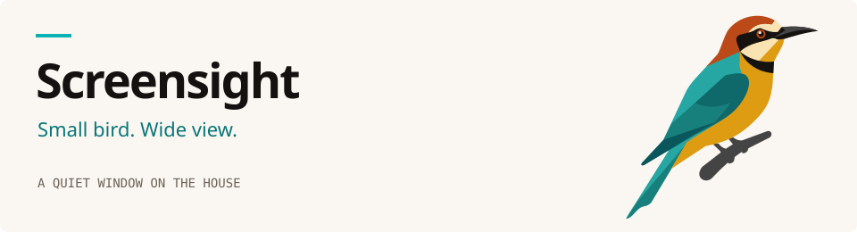
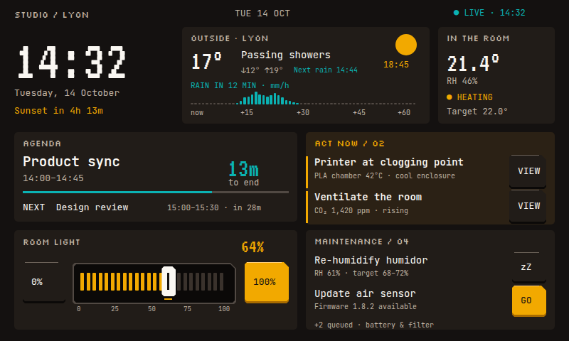

<picture>
  <source media="(prefers-color-scheme: dark)" srcset=".github/brand/header-dark.svg">
  <source media="(prefers-color-scheme: light)" srcset=".github/brand/header-light.svg">
  
</picture>

**Screensight** turns a Raspberry Pi, a small touchscreen and Home Assistant into
a calm, always-on status panel for your home. It pairs with Home Assistant over an
encrypted local link and shows what matters at a glance — no phone, no cloud.

  

## What's coming

Today the panel shows text pushed from Home Assistant. This is what it's becoming:

* **Room climate at a glance** — temperature, humidity and heating, in one look.
* **Air you can breathe** — CO₂, VOC and PM trends from your sensors.
* **Your day, handled** — agenda, bins, chores and routines.
* **Maintenance that nags politely** — batteries, filters and firmware, queued and snoozable.
* **Alerts that earn their place** — fire, toxic and corner cases escalate; everything else waits.
* **Light and media** — status and control for the rooms that matter.
* **Several homes, one panel** — pair multiple Home Assistant instances and switch between them.

## What you need

* A **Raspberry Pi** — a Pi 4 Model B is what this is built and tested on.
* An **800×480 DSI touchscreen**.
* A **Home Assistant** instance.

That's it.

---

Developer notes — building, packaging, deployment and the integration internals —
live in [`docs/development.md`](docs/development.md).
